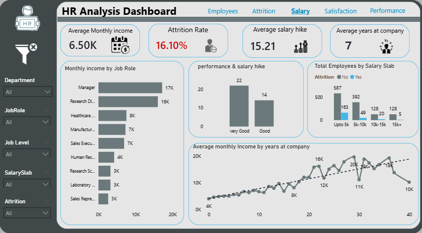
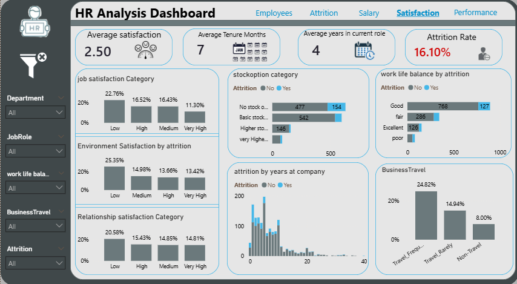

# 👥 HR Employee Attrition Analysis


---

## 📌 Project Overview

A full-scale HR analytics project analyzing **1,473 employee records** across 38 attributes including demographics, compensation, job satisfaction, performance, and attrition behavior. Data was modeled using a **Snowflake Schema in Power BI** with a central fact table and multiple dimension tables, producing interactive dashboards across 5 pages — alongside a complete **Python statistical analysis and Machine Learning predictive model** to identify employees at risk of leaving.

| Metric | Value |
|---|---|
| Total Employees | 1,473 |
| Attrition Rate | 16.10% |
| Employees Left | 237 |
| Employees Stayed | 1,236 (83.90%) |
| Average Age | 37 |
| Average Monthly Income | $6,500 |
| Average Years at Company | 7 |
| OverTime Rate | 28% |
| Average Satisfaction Score | 2.50 / 4 |

---

## 🗂️ Repository Structure

```
HR-Analysis-Project/
│
├── HR_PROJECT.pbix              # Power BI dashboard file
│
├── HR Snowflake.png             # Snowflake schema diagram
├── HR employees.png             # Employees page screenshot
├── Attrition.png                # Attrition page screenshot  (add when uploaded)
├── Salary.png                   # Salary page screenshot
├── satisfaction.png             # Satisfaction page screenshot
├── perfromane hr.png            # Performance page screenshot
│
├── hr_attrition_analysis.py     # Python statistical & ML analysis script
│
└── README.md
```

---

## 🏗️ Data Model — Snowflake Schema


The Power BI data model follows a **Snowflake Schema** design with one central fact table connected to multiple dimension tables — some of which have their own sub-dimensions.

| Table | Type | Key Fields |
|---|---|---|
| `fact_employee` | Fact | EmpID, DailyRate, DistanceFromHome, HourlyRate, MonthlyIncome, MonthlyRate, NumCompaniesWorked, OverTime, PercentSalaryHike, YearsAtCompany, YearsInCurrentRole, YearsSinceLastPromotion |
| `dim_employee` | Dimension | EmpID, Age, AgeGroup, Gender, MaritalStatus, Department_key, Education_key, JobLevel_key, JobRole_key |
| `dim_department` | Dimension | Department, Department_key |
| `dim_job_role` | Dimension | JobRole, JobRole_key |
| `dim_job_level` | Dimension | JobLevel Category, JobLevel_key |
| `dim_education` | Dimension | Education Category, Education_key |
| `dim_education_field` | Dimension | EducationField, EducationField_key |
| `dim_business_travel` | Dimension | BusinessTravel, BusinessTravel_key |
| `dim_performance_rating` | Dimension | Performance Rating Category, PerformanceRating_key |
| `dim_job_satisfaction` | Dimension | Job Satisfaction Category, Job_Satisfaction_key |
| `dim_work_life_balance` | Dimension | Work Life Balance Category, WorkLifeBalance_key |
| `dim_stock_option_level` | Dimension | StockOption Category, StockOptionLevel_key |
| `dim_job_involvement` | Dimension | Job Involvement Category, JobInvolvement_key |
| `Environment_satisfaction` | Dimension | Environment Satisfaction Category, EnvironmentSatisfaction_key |
| `Relationship_satisfaction` | Dimension | Relationship Satisfaction Category, RelationshipSatisfaction_key |
| `_measures_table` | Measures | Attrition Rate, Avg Monthly Income, Avg Performance Rating, Avg Salary Hike, Avg Satisfaction, Average Stay, Average Tenure Leave |

### Data Flow Steps

1. **Ingestion** — Loaded the source CSV (1,473 rows, 38 columns) into Power BI
2. **Modeling** — Structured data into a Snowflake Schema: 1 fact table + 14 dimension tables + 1 measures table
3. **Transformation** — Created calculated columns: AgeGroup, SalarySlab, satisfaction category labels, performance labels
4. **DAX Measures** — Built all KPIs using DAX: Attrition Rate, Avg Monthly Income, Overtime Rate, Avg Satisfaction, Average Tenure
5. **Dashboard** — Delivered a 5-page interactive report with slicers per page for Department, Gender, JobRole, Attrition, and more

---

## 📊 Power BI Dashboard

The dashboard spans **5 pages** — Employees, Attrition, Salary, Satisfaction, and Performance — each with dedicated slicers relevant to the page topic.

---

### Page 1 — Employees Overview


**KPIs:** Total Employees (1.472K) · Left Employees (237 — 16.10%) · Stayed Employees (1.472K — 83.90%) · Average Age (37)

**Visuals:**
- 🍩 Donut Charts: Total Employees by Gender — Male (734 stayed, 150 left) · Female (501 stayed, 87 left)
- 📊 Stacked Bar: Total Employees by Marital Status — Married (591 stayed, 84 left) · Single (350 stayed, 120 left) · Divorced (294 stayed)
- 📊 Bar Chart: Total Employees by Department — R&D leads (830 stayed, 133 left) · Sales (354 stayed, 92 left) · HR (51 stayed, 12 left)
- 📊 Stacked Bar: Total Employees by Age Group — 26–35 highest headcount (490 stayed, 116 left) · followed by 36–45 (425) · 46–55 (200) · 18–25 (79)
- 📊 Bar Chart: Total Employees by Education Field — Life Sciences (517) · Medical (401) · Marketing (124) · Technical Degree (100)

**Slicers:** Department / JobRole / Gender / AgeGroup / EducationField

---

### Page 2 — Attrition Analysis


**KPIs:** Total Employees (1.472K) · Attrition Rate (16.10%) · Distance from Home (9.20) · Overtime Rate (28%)

**Visuals:**
- 🍩 Donut Chart: OverTime — No Overtime 10.42% · Works Overtime 30.53%
- 📋 Matrix Table: Attrition Rate by Department & Job Role — Sales Representative (39.76%) · Laboratory Technician (23.85%) · Human Resources (23.08%) · Research Scientist (16.10%)
- 📈 Scatter Plot: Attrition Rate & Distance from Home — positive trend showing higher distance correlates with higher attrition
- 📊 Bar Chart: Attrition Rate by Age Group — 18–25 highest at 35.77% · 26–35 at 19.14% · 55+ at 17.02% · 46–55 at 11.50% · 36–45 lowest at 9.15%
- 📊 Stacked Bar: Promotion timing vs Attrition — Recently Promoted (472 stayed, 110 left) · 1–2 Years Ago (441 stayed, 76 left) · 5+ Years Ago (180 stayed, 35 left)

**Slicers:** Department / Gender / OverTime / BusinessTravel / Attrition

---

### Page 3 — Salary & Compensation



**KPIs:** Average Monthly Income ($6.50K) · Attrition Rate (16.10%) · Average Salary Hike (15.21%) · Average Years at Company (7)

**Visuals:**
- 📊 Bar Chart: Monthly Income by Job Role — Manager ($17K) · Research Director ($16K) · Healthcare Representative ($8K) · Manufacturing Director ($7K) · Sales Executive ($7K) · Sales Representative ($3K)
- 📊 Bar Chart: Performance & Salary Hike — Very Good rating (22% hike avg) · Good rating (14% hike avg)
- 📊 Stacked Bar: Total Employees by Salary Slab (with Attrition) — Upto $5K (587 stayed, 163 left) · $5K–$10K (391 stayed, 49 left) · $10K–$15K (128 stayed, 20 left) · $15K+ (128 stayed, 5 left)
- 📈 Line Chart: Average Monthly Income by Years at Company — clear upward trend; income grows from $4K at Year 0 to $16–20K range at 30+ years

**Slicers:** Department / JobRole / JobLevel / SalarySlab / Gender / Attrition

---

### Page 4 — Satisfaction & Wellbeing



**KPIs:** Average Satisfaction (2.50) · Average Tenure Months (7) · Average Years in Current Role (4) · Attrition Rate (16.10%)

**Visuals:**
- 📊 Bar Chart: Job Satisfaction Category — Low (22.76%) · High (16.52%) · Medium (16.43%) · Very High (11.30%)
- 📊 Bar Chart: Environment Satisfaction by Attrition — Low satisfaction = 25.35% attrition · Medium 14.98% · High 13.66% · Very High 13.42%
- 📊 Bar Chart: Relationship Satisfaction Category — Low (20.58%) · High (15.43%) · Medium (14.85%) · Very High (14.81%)
- 📊 Stacked Bar: Stock Option Category by Attrition — No Stock Options (477 stayed, 154 left) · Basic (540 stayed) · Higher (146 stayed)
- 📈 Histogram: Attrition by Years at Company — highest attrition in first 1–2 years; drops significantly after year 5
- 📊 Bar Chart: Work Life Balance by Attrition — Good (766 stayed, 127 left) · Fair (286 stayed) · Excellent (126 stayed)
- 📊 Bar Chart: Business Travel Attrition Rate — Travel Frequently (24.82%) · Travel Rarely (14.94%) · Non-Travel (8.00%)

**Slicers:** Department / JobRole / Attrition / BusinessTravel / WorkLifeBalance

---

### Page 5 — Performance & Growth


**KPIs:** Average Performance Rating (4) · Attrition Rate (16.10%) · Average Training Sessions (3) · Average Years at Company (7)

**Visuals:**
- 📊 Bar Chart: Attrition Rate by Education Level — Below College (18.13%) · Bachelor (17.31%) · College (15.55%) · Master (14.57%) · Doctor (10.42%)
- 🍩 Donut: Performance Rating Distribution — Good (16.05%) · Very Good (16.37%)
- 📊 Bar Chart: Training Times Last Year — 0 sessions (27.78%) · 2 sessions (17.92%) · 4 sessions (21.14%) · 6 sessions (9.23%)
- 📊 Bar Chart: Job Involvement — Low (33.73%) · Medium (18.88%) · High (14.40%) · Very High (8.97%)

**Slicers:** Department / JobRole / EducationField / Gender / Attrition

---

## 🐍 Python Statistical & ML Analysis

Beyond Power BI, a complete Python analysis was conducted covering distribution analysis, statistical testing, regression modeling, and machine learning prediction.

### Part 1 — Distribution Analysis

Histograms and Box Plots for key numeric columns: `Age`, `MonthlyIncome`, `DistanceFromHome`, `YearsAtCompany`, `TotalWorkingYears`, `YearsSinceLastPromotion`, `NumCompaniesWorked`

**Key Findings:**
- `MonthlyIncome` — Right-skewed (Skew: 1.37) with 114 outliers — senior managers inflate the upper tail
- `YearsAtCompany` — Right-skewed (Skew: 1.77) with 104 outliers — most employees have short tenure
- `YearsSinceLastPromotion` — Highly skewed (Skew: 1.99) with 107 outliers — many employees haven't been promoted in years
- `Age` — Near-normal distribution (Skew: 0.41) — no significant outliers

### Part 2 — Statistical Tests

#### T-Test — Numeric Columns (Stayed vs Left)

| Column | T-Statistic | P-Value | Result |
|---|---|---|---|
| Age | t = +6.168 | 0.0000 | ✅ Significant |
| MonthlyIncome | t = +6.195 | 0.0000 | ✅ Significant |
| DistanceFromHome | t = −2.985 | 0.0029 | ✅ Significant |
| YearsAtCompany | t = +5.190 | 0.0000 | ✅ Significant |
| TotalWorkingYears | t = +6.650 | 0.0000 | ✅ Significant |
| JobSatisfaction | t = +3.982 | 0.0001 | ✅ Significant |
| WorkLifeBalance | t = +2.468 | 0.0137 | ✅ Significant |
| EnvironmentSatisfaction | t = +4.011 | 0.0001 | ✅ Significant |
| NumCompaniesWorked | t = −1.669 | 0.0954 | ❌ Not Significant |

#### Chi-Square Test — Categorical Columns

| Column | Chi² | P-Value | Result |
|---|---|---|---|
| OverTime | 88.042 | 0.0000 | ✅ Significant |
| MaritalStatus | 46.104 | 0.0000 | ✅ Significant |
| BusinessTravel | 25.173 | 0.0000 | ✅ Significant |
| Department | 10.793 | 0.0045 | ✅ Significant |
| JobRole | 85.294 | 0.0000 | ✅ Significant |
| EducationField | 16.224 | 0.0062 | ✅ Significant |
| Gender | 1.107 | 0.2928 | ❌ Not Significant |

#### ANOVA — Monthly Income by Groups

| Group | F-Statistic | P-Value | Result |
|---|---|---|---|
| MonthlyIncome by Department | F = 3.129 | 0.0441 | ✅ Significant |
| MonthlyIncome by JobRole | F = 812.012 | 0.0000 | ✅ Significant |
| MonthlyIncome by MaritalStatus | F = 5.991 | 0.0026 | ✅ Significant |
| MonthlyIncome by BusinessTravel | F = 1.219 | 0.3015 | ❌ Not Significant |
| MonthlyIncome by EducationField | F = 2.001 | 0.0758 | ❌ Not Significant |

### Part 3 — Logistic Regression (Feature Significance)

Using `statsmodels` to identify which features significantly impact Attrition:

| Feature | Coefficient | P-Value | Significant |
|---|---|---|---|
| OverTime_enc | +1.5841 | 0.000 | ✅ Strongest driver of attrition |
| EnvironmentSatisfaction | −0.3436 | 0.000 | ✅ Higher satisfaction = less attrition |
| JobSatisfaction | −0.3118 | 0.000 | ✅ Higher satisfaction = less attrition |
| NumCompaniesWorked | +0.1237 | 0.000 | ✅ More job-hopping history = higher risk |
| Age | −0.0488 | 0.000 | ✅ Older employees more stable |
| WorkLifeBalance | −0.2487 | 0.020 | ✅ Better balance = less attrition |
| DistanceFromHome | +0.0303 | 0.001 | ✅ Farther distance = higher attrition |
| MonthlyIncome | −0.000 | 0.454 | ❌ Not significant after controlling others |
| JobLevel | −0.2285 | 0.341 | ❌ Not significant after controlling others |
| YearsAtCompany | −0.0186 | 0.342 | ❌ Not significant after controlling others |

**Model Stats:** Pseudo R² = 0.1722 · LLR p-value = 1.664e-42 · Observations = 1,473

### Part 4 — ML Predictive Modeling

**Selected Features (Significant columns only):**
`Age`, `OverTime_enc`, `DistanceFromHome`, `JobSatisfaction`, `WorkLifeBalance`, `EnvironmentSatisfaction`, `NumCompaniesWorked`

**Train / Test Split:** 80% Train (1,178 rows) / 20% Test (295 rows) — Stratified on Attrition

#### Model Results on Test Data

| Metric | Logistic Regression | Random Forest |
|---|---|---|
| **Accuracy** | **85.76%** | 84.41% |
| **AUC** | **0.850** | 0.813 |
| Precision — Stay | 0.86 | 0.86 |
| Precision — Leave | 0.86 | 0.55 |
| Recall — Stay | 1.00 | 0.98 |
| Recall — Leave | 0.13 | 0.13 |
| F1-Score — Stay | 0.92 | 0.91 |
| F1-Score — Leave | 0.22 | 0.21 |

**Winner: Logistic Regression** — Higher AUC (0.850) and better Precision on the Leave class.

> ⚠️ **Note on Recall:** Both models show low Recall for the Leave class (0.13) due to class imbalance — 84% Stay vs 16% Leave. This can be improved by applying `class_weight='balanced'` to the Logistic Regression.

---

## 📈 Key Findings & Strategic Analysis

### 1. OverTime — The #1 Driver of Attrition

OverTime is the single strongest predictor of employee departure — employees working overtime churn at **30.53%** vs **10.42%** for those who don't. The logistic regression coefficient of +1.584 makes it the most impactful variable in the model.

**Action:** Cap mandatory overtime, introduce comp time policies, and flag all overtime employees in HR systems for proactive check-ins.

---

### 2. Age Group — Young Employees Are Highest Risk

| Age Group | Attrition Rate |
|---|---|
| 18–25 | **35.77%** |
| 26–35 | 19.14% |
| 55+ | 17.02% |
| 46–55 | 11.50% |
| 36–45 | **9.15%** (lowest) |

Young employees (18–25) churn at nearly 4× the rate of mid-career employees (36–45). They are likely testing the job market, have fewer financial commitments, and are more sensitive to job satisfaction and growth opportunities.

**Action:** Build dedicated early-career development programs, mentorship schemes, and fast-track promotion paths for employees under 30.

---

### 3. Job Role — Sales Representatives Are in Crisis

| Job Role | Attrition Rate |
|---|---|
| Sales Representative | **39.76%** |
| Laboratory Technician | 23.85% |
| Human Resources | 23.08% |
| Research Scientist | 16.10% |
| Manager | 5.56% |
| Research Director | **2.50%** (lowest) |

Sales Representatives churn at nearly 8× the rate of Research Directors. This is likely driven by high-pressure targets, lower base salaries ($3K avg vs $17K for Managers), and frequent business travel.

**Action:** Review Sales Representative compensation structure, set realistic targets, and introduce performance-based bonuses rather than pure commission pressure.

---

### 4. Satisfaction Scores — Low Environment Satisfaction = High Risk

Employees with Low Environment Satisfaction churn at **25.35%** — nearly double those with Very High satisfaction (13.42%). Similarly, Low Job Satisfaction drives 22.76% attrition rate overall.

**Action:** Run quarterly anonymous satisfaction surveys segmented by department; set department-level satisfaction KPIs for managers; address low-scoring departments with targeted interventions.

---

### 5. Salary — The $5K Floor Problem

| Salary Slab | Stayed | Left | Attrition Rate |
|---|---|---|---|
| Upto $5K | 587 | 163 | **21.7%** |
| $5K–$10K | 391 | 49 | 11.1% |
| $10K–$15K | 128 | 20 | 13.5% |
| $15K+ | 128 | 5 | **3.8%** |

The lowest salary band ($0–5K) drives the highest attrition. As income rises, attrition falls dramatically — employees earning $15K+ have only 3.8% attrition.

**Action:** Prioritize salary benchmarking for employees in the sub-$5K band; introduce structured annual increments tied to tenure rather than purely performance.

---

### 6. Promotion Gap — Stagnation Drives Departure

Employees who haven't been promoted in **5+ years** show significantly higher attrition. The distribution of YearsSinceLastPromotion is highly right-skewed — many employees are waiting years without advancement.

**Action:** Implement a formal promotion review cycle — every employee should have a documented career path conversation every 12 months. Flag any employee with 3+ years since last promotion for immediate review.

---

### 7. Business Travel — Frequent Travel = Higher Churn

| Travel Frequency | Attrition Rate |
|---|---|
| Travel Frequently | **24.82%** |
| Travel Rarely | 14.94% |
| Non-Travel | **8.00%** |

Frequent travelers churn at 3× the rate of non-travelers. Business travel disrupts work-life balance, increases fatigue, and reduces job satisfaction — especially for younger employees.

**Action:** Review travel policies; introduce travel allowances and flexibility perks; offer remote options post-travel; reduce required travel for high-risk roles.

---

### 8. Distance from Home — Geography Matters

The T-Test confirms DistanceFromHome is statistically significant (p = 0.0029) — employees who left lived farther from the office on average. The scatter plot shows a positive correlation between distance and attrition rate.

**Action:** Offer remote/hybrid arrangements to employees commuting over a set threshold; provide commuter benefits; consider satellite office locations in high-density employee residential areas.

---

## 🎯 Strategic Recommendations Roadmap

### Tier 1 — Immediate Action (Next 30 Days)

| Action | Detail | Estimated Impact |
|---|---|---|
| OverTime Policy Reform | Cap weekly overtime hours; introduce mandatory comp time; flag all overtime employees for HR check-in | Reduce attrition rate by 3–5% |
| Sales Rep Emergency Intervention | Review compensation structure; reduce travel requirements; introduce base salary floor review | Reduce Sales attrition from 39.76% to under 25% |
| Low Salary Band Review | Benchmark all sub-$5K employees against market rates; implement structured increment plan | Address 21.7% attrition in lowest salary slab |

### Tier 2 — Short Term (60–90 Days)

| Action | Detail | Estimated Impact |
|---|---|---|
| Young Employee Development Program | Fast-track promotion paths; mentorship for 18–30 age group; quarterly career conversations | Reduce 18–25 attrition from 35.77% to under 20% |
| Satisfaction Survey & Action Plan | Dept-level quarterly surveys; satisfaction KPIs for managers; targeted interventions for Low scorers | Improve avg satisfaction from 2.50 to 3.00+ |
| Promotion Review Cycle | Flag all employees with 3+ years since promotion; structured 12-month career path conversations | Reduce attrition for stagnated employees |

### Tier 3 — Medium Term (6 Months)

| Action | Detail | Estimated Impact |
|---|---|---|
| Remote/Hybrid Policy | Offer flexibility to employees >15km from office; commuter benefit scheme | Address DistanceFromHome attrition driver |
| Business Travel Reform | Cap frequent travel; introduce travel recovery days; rotate travel responsibilities | Reduce frequent traveler attrition from 24.82% |
| ML Early Warning System | Deploy the Logistic Regression model in HR systems to flag at-risk employees monthly | Proactively identify 85%+ of potential leavers |

---

## 💰 Financial Impact Summary

| Metric | Value |
|---|---|
| Employees Who Left | 237 |
| Attrition Rate | 16.10% |
| Average Monthly Income | $6,500 |
| Estimated Annual Cost per Attrition* | ~$19,500 (3× monthly salary) |
| **Estimated Annual Cost of Attrition** | **~$4.6M** |

> *Industry standard: replacing an employee costs 1.5–3× their annual salary in recruiting, onboarding, and lost productivity.

**Churn Reduction Scenarios:**

| Scenario | Employees Retained | Estimated Savings |
|---|---|---|
| Reduce attrition by 20% | 47 employees | ~$920K |
| Reduce attrition by 30% | 71 employees | ~$1.38M |
| Reduce attrition by 50% | 119 employees | ~$2.3M |

---

## 🛠️ Tech Stack

| Tool | Role |
|---|---|
| **Power BI Desktop** | Data modeling, DAX measures, 5-page interactive dashboard |
| **Power Query** | Data cleaning, type casting, AgeGroup & SalarySlab columns |
| **DAX** | All KPI measures — Attrition Rate, Avg Monthly Income, Overtime Rate, Avg Satisfaction |
| **Snowflake Schema** | Data model — 1 fact table, 14 dimension tables, 1 measures table |
| **Python** | Full statistical analysis & ML predictive modeling |
| **Pandas / NumPy** | Data manipulation and feature engineering |
| **Matplotlib / Seaborn** | Distribution plots, box plots, correlation heatmap |
| **Scipy** | T-Tests, Chi-Square Tests, ANOVA |
| **Statsmodels** | Logistic Regression with p-values and coefficients |
| **Scikit-Learn** | ML models (Logistic Regression, Random Forest), train/test split, evaluation metrics |

---

## 🚀 How to Reproduce

### Power BI Dashboard

1. Open Power BI Desktop → `Get Data → Text/CSV` → load the HR dataset
2. In Power Query, clean and create calculated columns: `AgeGroup`, `SalarySlab`
3. Build the Snowflake Schema — split into 14 dimension tables + 1 fact table + 1 measures table
4. Create DAX measures: `Attrition Rate`, `Overtime Rate`, `Avg Satisfaction`, `Avg Monthly Income`
5. Build the 5 dashboard pages with slicers per page
6. Or open `HR_PROJECT.pbix` directly

### Python Analysis

```bash
# Install dependencies
pip install pandas numpy matplotlib seaborn scipy statsmodels scikit-learn

# Run the full analysis
python hr_attrition_analysis.py
```

Outputs 6 image files:
- `1_distributions.png` — Histograms
- `2_boxplots.png` — Outlier detection
- `3_correlation_heatmap.png` — Correlation matrix
- `4_logistic_regression.png` — Feature coefficients
- `5_random_forest_importance.png` — Feature importance
- `6_model_evaluation.png` — Confusion Matrix + ROC Curve

---

## 👤 Author

Built as a personal HR analytics portfolio project demonstrating end-to-end data modeling (Snowflake Schema), DAX development, statistical analysis, and machine learning prediction for an HR employee attrition dataset.

---

## 📄 License

This project is licensed under the MIT License.
